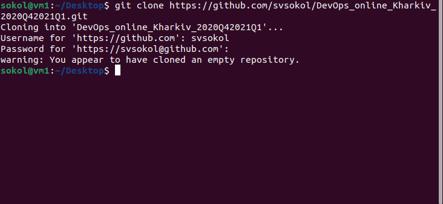
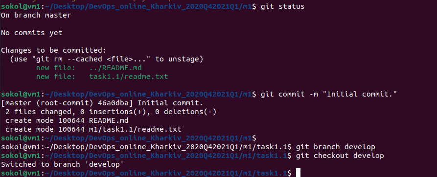
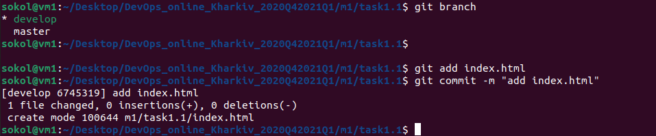
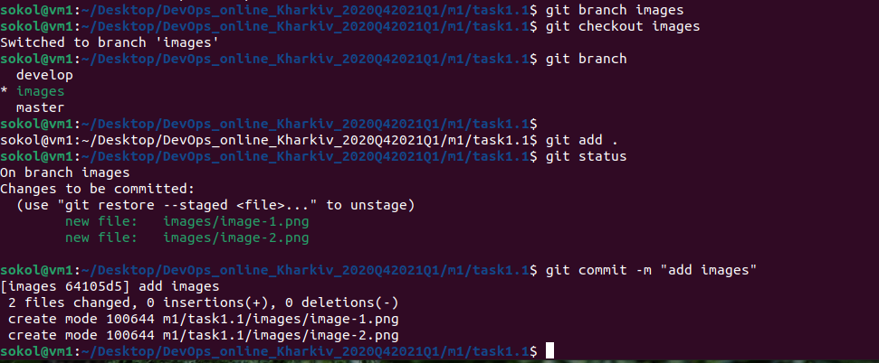
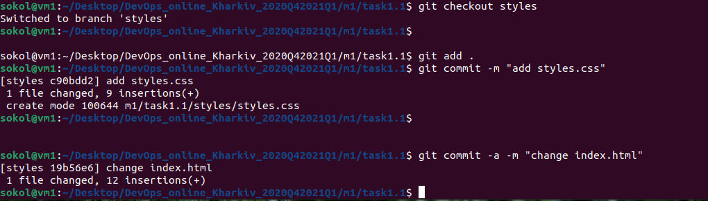

# DEVOPS

DevOps is a concept with different interpretations and definitions, but when you get down to it, 
it’s all about developers and operations teams breaking down silos and working together to innovate faster.

