### What's the difference between a hub, switch or router?

##### Hub
A hub is to sent out a message from one port to other ports. For example, if there are three computers of PC0, PC1, PC2, the message sent by a hub for computer PC0 will also come to the other computers. But only computer PC0 will respond and the response will also go out to every other port on the hub. Therefore, all the computers can receive the message and computers themselves need to decide whether to accept the message.

##### Switch
A switch is able to handle the data and knows the specific addresses to send the message. It can decide which computer is the message intended for and send the message directly to the right computer. The efficiency of switch has been greatly improved, thus providing a faster network speed.

##### Router
Router is actually a small computer that can be programmed to handle and route the network traffic. It usually connects at least two networks together, such as two LANs, two WANs or a LAN and its ISP network. Routers can calculate the best route for sending data and communicate with each other by protocols.

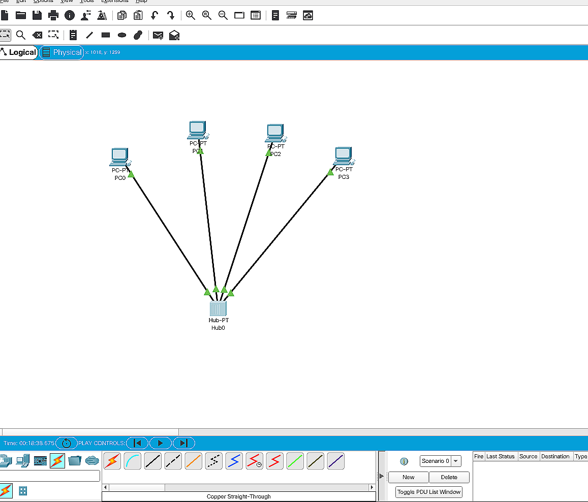

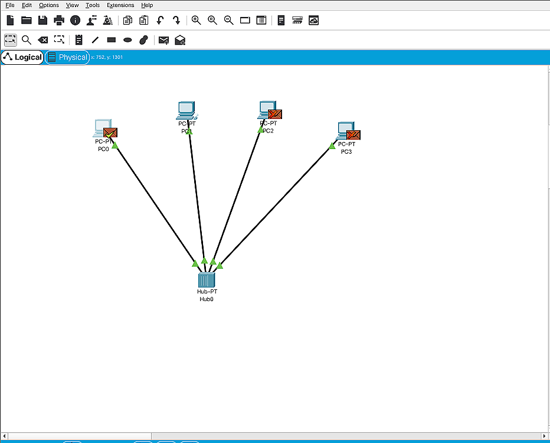
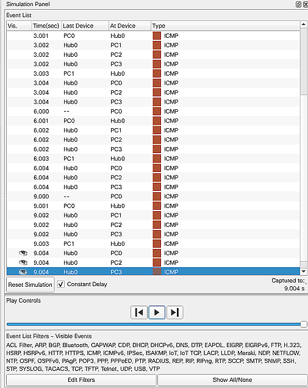
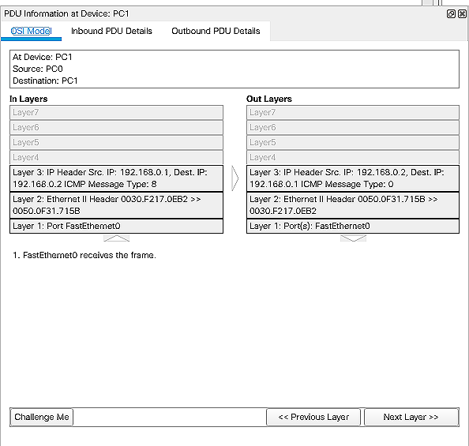
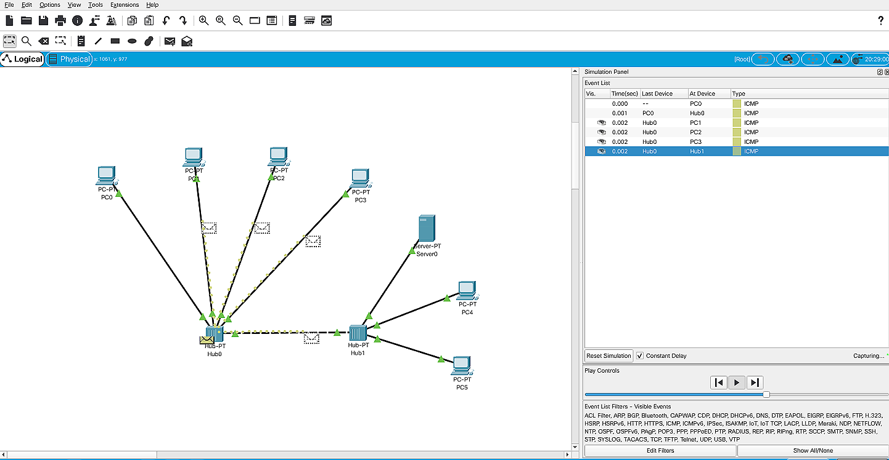
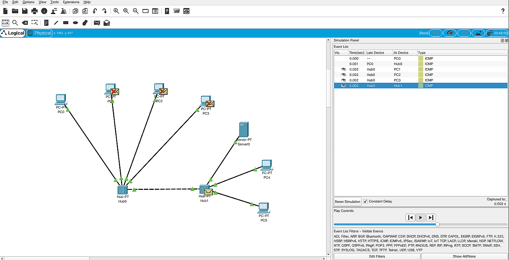

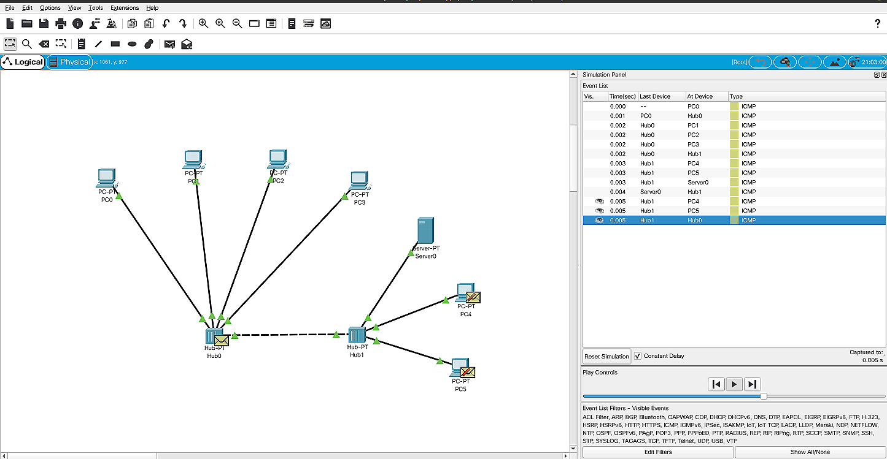
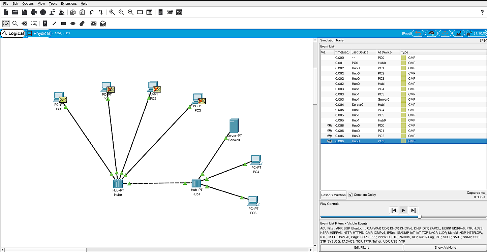
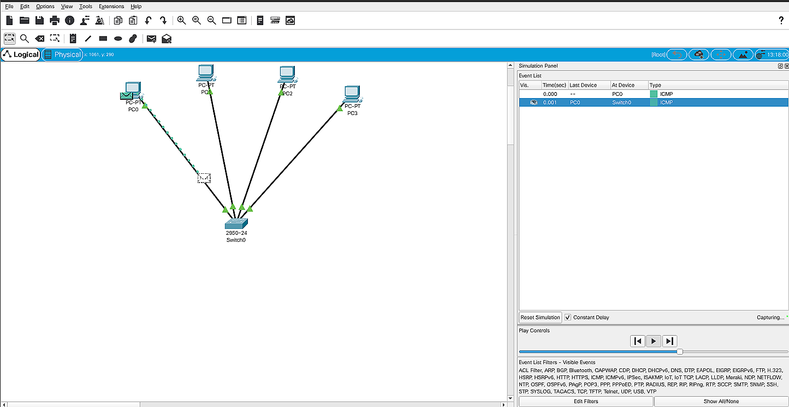
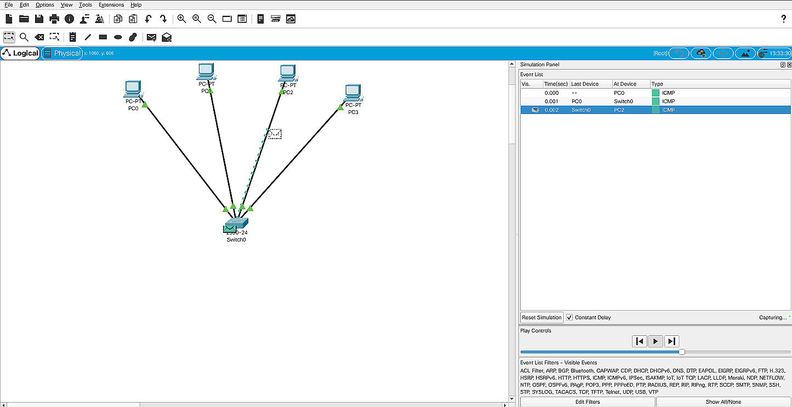
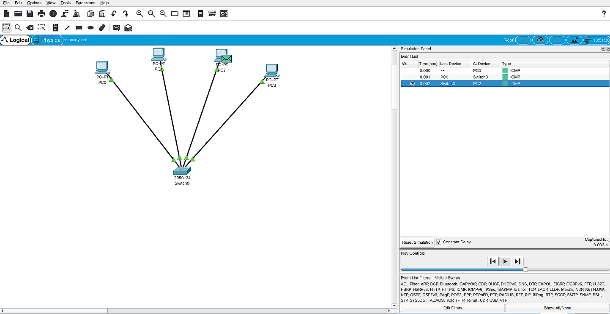
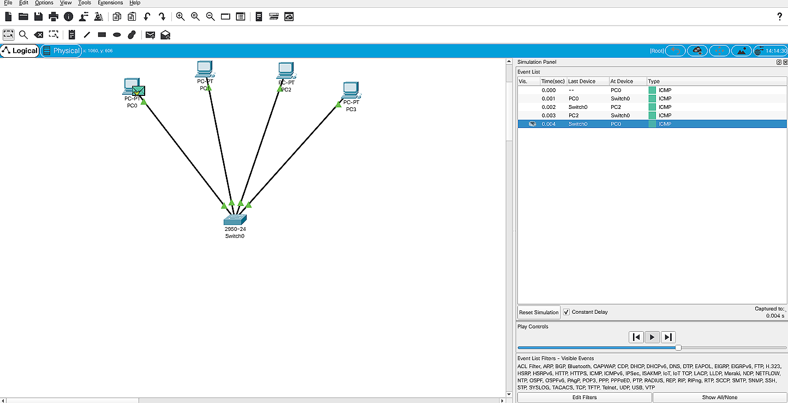
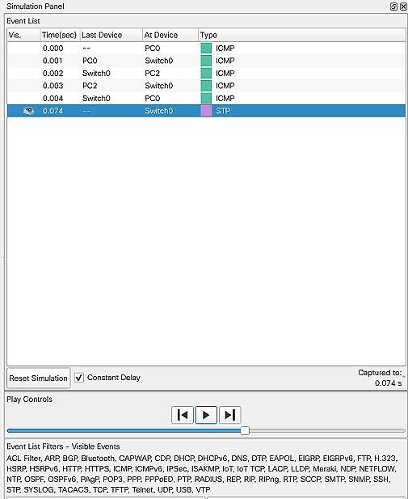
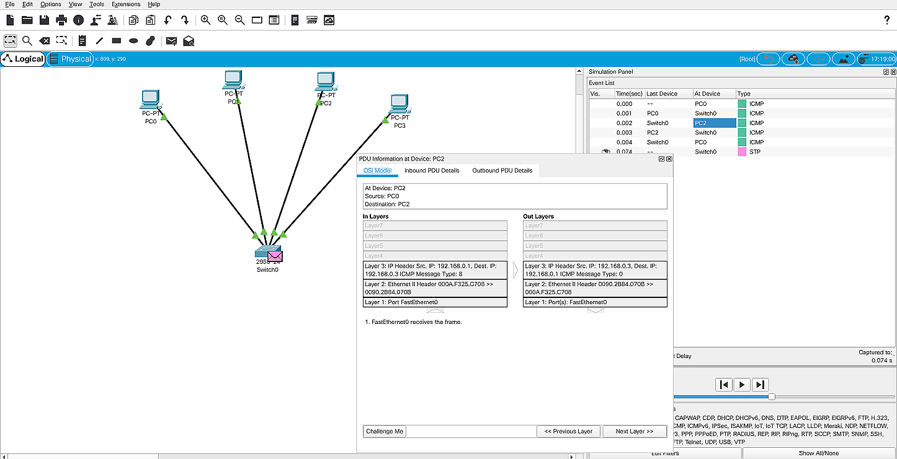
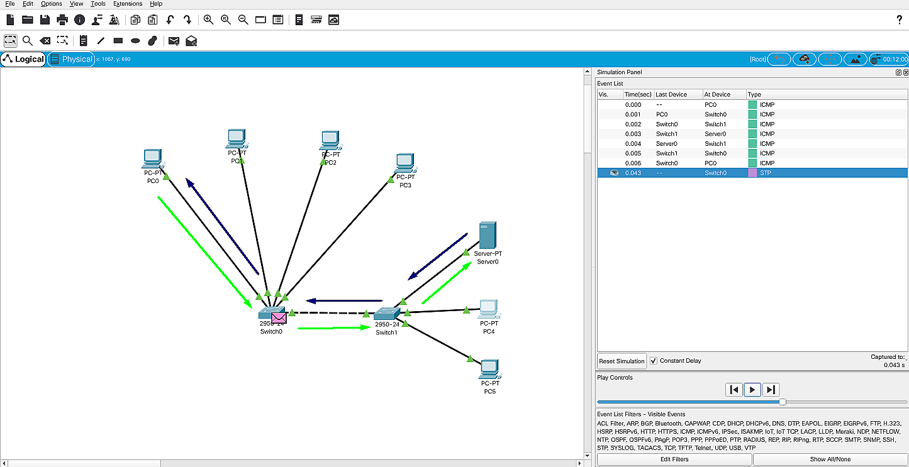
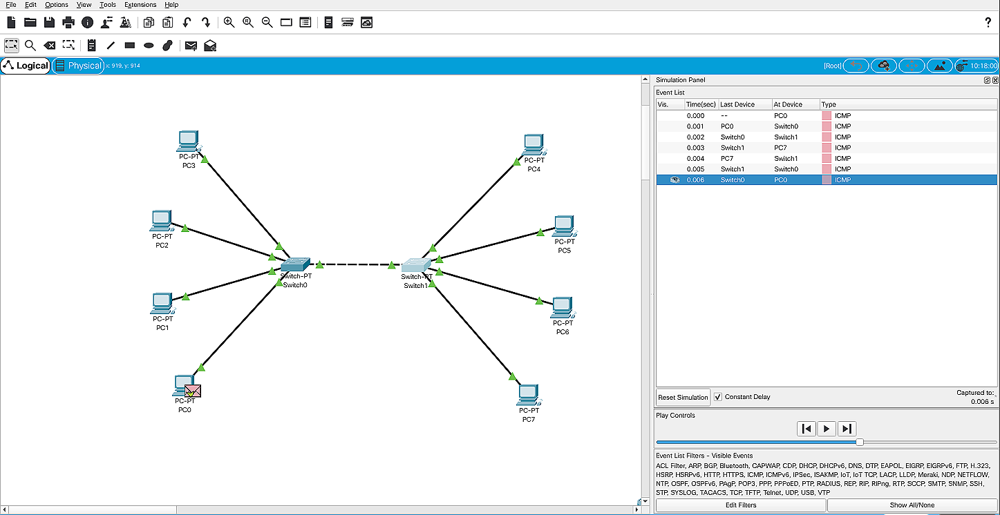
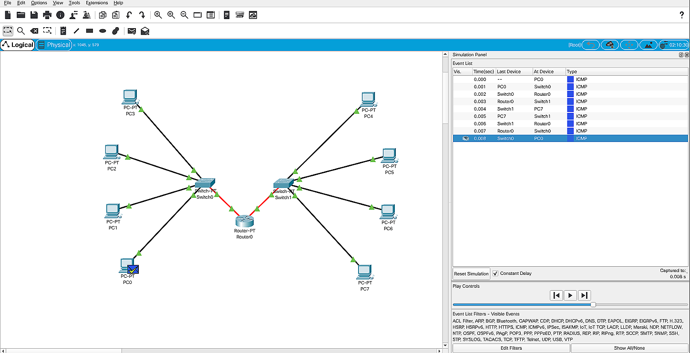
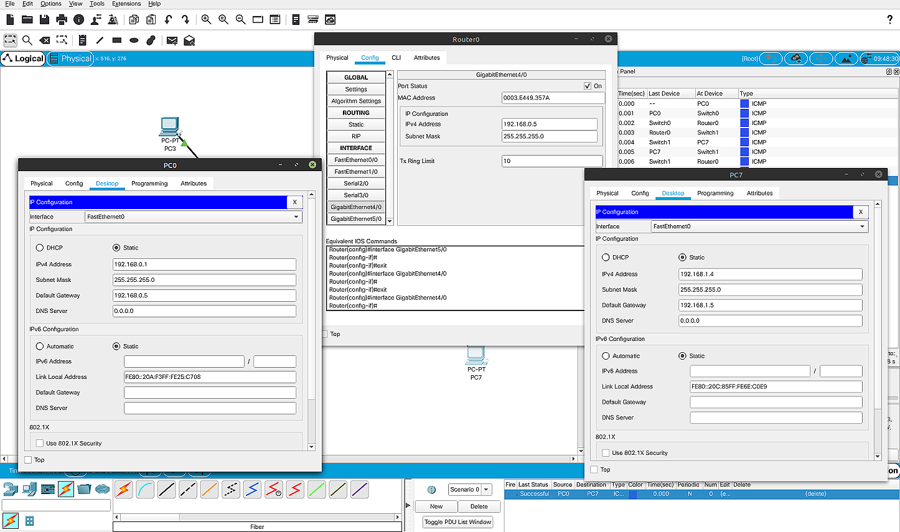

